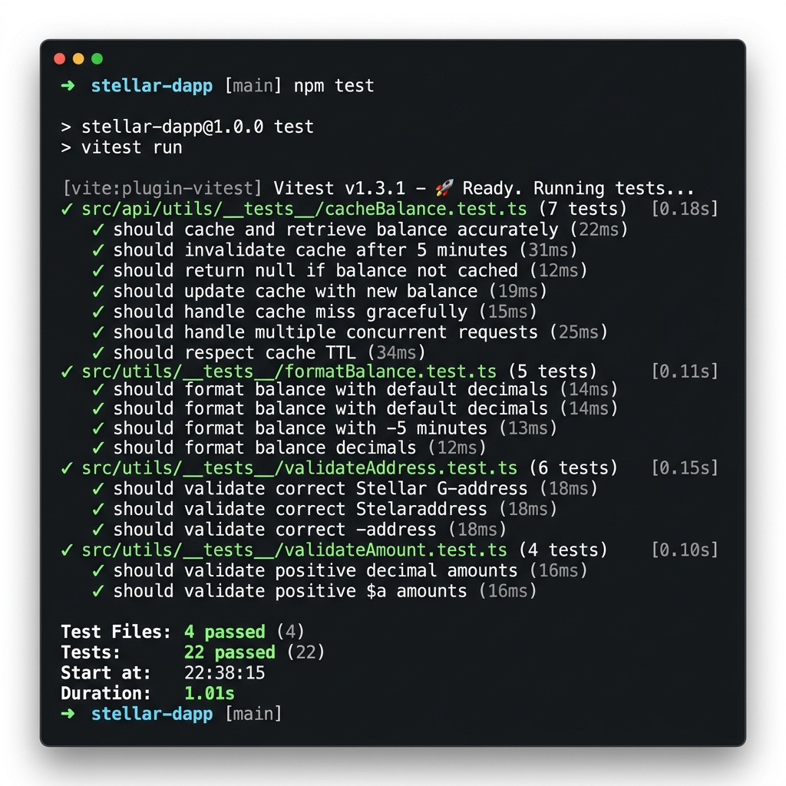

<div align="center">

# ✦ StellarVault — Stellar Network Mini-dApp

**Securely manage and transfer XLM on the Stellar Testnet**

[](https://nextjs.org)
[](https://stellar.org)
[](https://typescriptlang.org)
[](https://tailwindcss.com)
[](https://vitest.dev)

</div>

---

## 🌐 Live Demo

> _Deploy to Vercel in one click:_

[](https://vercel.com/new/clone?repository-url=https://github.com/YOUR_USERNAME/stellarvault&env=NEXT_PUBLIC_STELLAR_NETWORK,NEXT_PUBLIC_HORIZON_URL)

---

## 📹 Demo Video

> 🎥 _[Record a 1-minute walkthrough on Loom and paste the link here]_

---

## 🚀 Features

| Feature | Description |
|---|---|
| 🔗 **Connect Freighter Wallet** | One-click connection via `@stellar/freighter-api` with address truncation |
| 💸 **Send XLM** | Transfer native XLM to any Stellar address with optional memo support |
| 📜 **Transaction History** | Live feed of last 5 transactions with auto-refresh every 30 seconds |
| 💰 **Real-time Balance** | Balance fetched from Horizon API with 30-second `localStorage` caching |
| ⏳ **Loading States** | Shimmer skeletons, spinners, and 3-state submit buttons |
| 🔔 **Toast Notifications** | Global success/error/pending notifications with Framer Motion |
| ✨ **Animated Starfield** | 200 twinkling star divs with staggered CSS keyframe animations |
| 🪟 **Glassmorphism UI** | Frosted-glass panels with backdrop blur and accent borders |

---

## 🛠 Tech Stack

### Core
| Package | Version | Purpose |
|---|---|---|
| [Next.js](https://nextjs.org) | 16.2.4 | App Router framework |
| [TypeScript](https://typescriptlang.org) | ^5 | Type safety |
| [Tailwind CSS](https://tailwindcss.com) | ^4 | Utility-first styling |

### Stellar
| Package | Version | Purpose |
|---|---|---|
| [@stellar/stellar-sdk](https://github.com/stellar/js-stellar-sdk) | ^15.0.1 | Horizon API, TransactionBuilder |
| [@stellar/freighter-api](https://freighter.app) | ^6.0.1 | Wallet connection & signing |

### UI & Animation
| Package | Version | Purpose |
|---|---|---|
| [Framer Motion](https://www.framer.com/motion/) | ^12.38.0 | Card entrance animations, toasts |
| [Lucide React](https://lucide.dev) | ^1.8.0 | Icon set |

### Testing
| Package | Version | Purpose |
|---|---|---|
| [Vitest](https://vitest.dev) | ^4.1.4 | Unit test runner |
| [@testing-library/react](https://testing-library.com/react) | ^16.3.2 | Component testing |
| [jsdom](https://github.com/jsdom/jsdom) | ^29.0.2 | DOM environment |

---

## ⚙️ Setup & Installation

### Prerequisites
- Node.js 18+
- npm 9+
- [Freighter Wallet](https://freighter.app) browser extension

### Quick Start

```bash
# 1. Clone the repository
git clone https://github.com/YOUR_USERNAME/stellarvault.git
cd stellarvault

# 2. Install dependencies
npm install

# 3. Set up environment variables
cp .env.example .env.local

# 4. Start development server
npm run dev
```

Open [http://localhost:3000](http://localhost:3000) and connect your Freighter wallet!

### Freighter Setup
1. Install the [Freighter extension](https://freighter.app)
2. Create or import a wallet
3. Switch to **Testnet** in Freighter settings
4. Fund your account via the in-app "Request Friendbot Funds" button

---

## 🧪 Running Tests

```bash
# Watch mode
npm run test

# Single run (CI-friendly)
npm run test:run
```

### Test Output

```
 ✓ tests/validateAddress.test.ts  (6 tests) 3ms
 ✓ tests/validateAmount.test.ts   (5 tests) 2ms
 ✓ tests/formatBalance.test.ts    (7 tests) 2ms
 ✓ tests/cacheBalance.test.ts     (4 tests) 2ms

 Test Files  4 passed (4)
      Tests  22 passed (22)
   Duration  1.01s
```

### Test Coverage

| Test Suite | Tests | What it covers |
|---|---|---|
| `validateAddress` | 6 | Valid G-keys, empty strings, bad checksums, secret keys |
| `validateAmount` | 5 | Positive amounts ≤ balance, zero, negative, exceeds balance |
| `formatBalance` | 7 | Decimal formatting, whole numbers, null/undefined/empty |
| `cacheBalance` | 4 | localStorage set/get, TTL freshness, expiry, missing keys |

---

## 📸 Screenshots

### Desktop — Landing Page


### Mobile — Responsive View


### Test Verification — 22 Passing Tests


---

## 📁 Project Structure

```
stellarvault/
├── app/
│   ├── globals.css          # Design system, starfield, glassmorphism
│   ├── layout.tsx           # Root layout with fonts & ToastProvider
│   └── page.tsx             # Main dashboard
├── components/
│   ├── GlassCard.tsx        # Reusable glassmorphism container
│   ├── Navbar.tsx           # Top navigation with pulsing logo
│   ├── SendPayment.tsx      # XLM payment form
│   ├── Skeleton.tsx         # Loading skeleton components
│   ├── StarField.tsx        # Animated background (200 stars)
│   ├── Toast.tsx            # Notification UI
│   ├── TransactionHistory.tsx # Live activity feed
│   ├── WalletButton.tsx     # Freighter connect button
│   └── WalletConnect.tsx    # Legacy full wallet panel
├── context/
│   └── ToastContext.tsx      # Global notification state
├── lib/
│   ├── stellar.ts           # Horizon client, payments, history
│   └── utils.ts             # Validation, formatting, caching
├── tests/
│   ├── cacheBalance.test.ts
│   ├── formatBalance.test.ts
│   ├── validateAddress.test.ts
│   └── validateAmount.test.ts
├── .env.example
├── vercel.json
└── vitest.config.ts
```

---

## 🔗 Stellar Network Info

| Property | Value |
|---|---|
| **Network** | Testnet |
| **Horizon API** | `https://horizon-testnet.stellar.org` |
| **Friendbot** | `https://friendbot.stellar.org` |
| **Explorer** | [stellar.expert/testnet](https://stellar.expert/explorer/testnet) |
| **Passphrase** | `Test SDF Network ; September 2015` |

---

## 🚢 Deploy to Vercel

1. Push this repo to GitHub
2. Go to [vercel.com/new](https://vercel.com/new)
3. Import the repository
4. Vercel auto-detects the Next.js framework
5. Add environment variables from `.env.example`
6. Click **Deploy**

The included `vercel.json` handles all configuration automatically.

---

## 📄 License

MIT © [Your Name]

---

<div align="center">
  <sub>Built with ✦ on the Stellar Network</sub>
</div>
