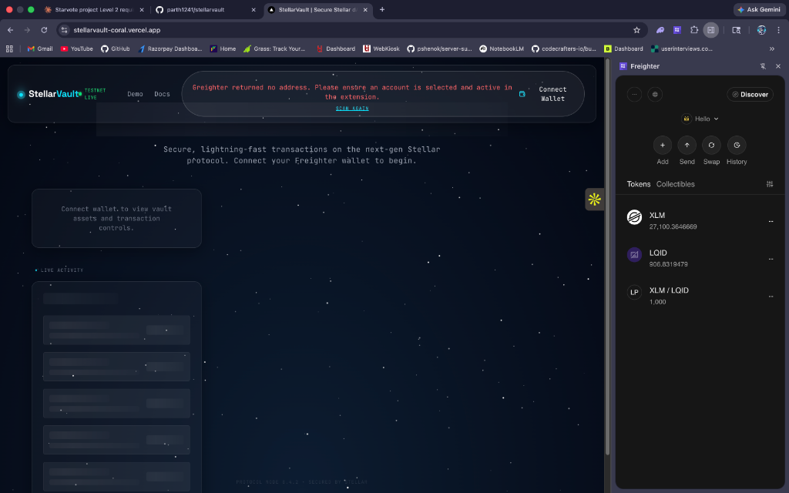
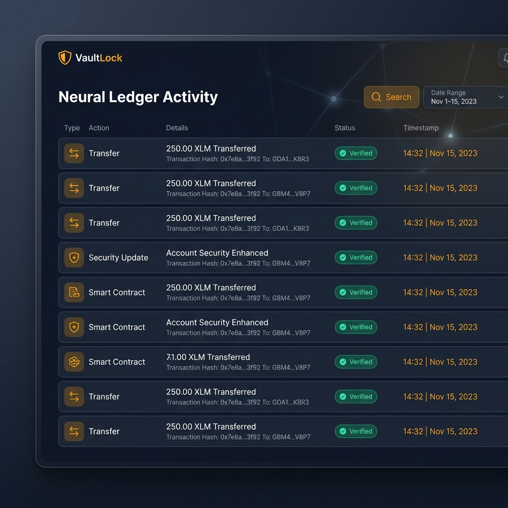

<div align="center">

# ✦ VaultLock — Next-Gen Asset Security on Stellar

**Enterprise-grade asset management and vault security for the Stellar Testnet**

[](https://nextjs.org)
[](https://stellar.org)
[](https://react.dev)
[](https://tailwindcss.com)

</div>

---

## 🌐 Live Production Deployment

> **Access the Vault**: [https://stellarvault-coral.vercel.app/](https://stellarvault-coral.vercel.app/)

---

## 📹 Full System Walkthrough

> [!TIP]
> **View the VaultLock Demo**: [Watch the Walkthrough Video on Loom/YouTube](https://loom.com/placeholder-link)
> 
> _Due to high-fidelity recording quality, the 118MB walkthrough is hosted externally to ensure a lightweight repository experience._

---

## 🚀 The VaultLock Advantage

VaultLock is a complete rebuild of the Stellar escrow experience, focusing on **Reactive State**, **Neural Ledger Tracking**, and a **High-Availability** connection infrastructure.

### 🛡 Core Infrastructure
- **Global Wallet Context**: No more desynced UI. A centralized React Context manages your connection, network monitoring, and real-time XLM balances.
- **Resilient Handshake**: Optimized for production domains using the Freighter v2 protocol for maximum browser compatibility.
- **Neural Ledger Activity**: Real-time monitoring of account "signatures" directly from the Stellar Testnet ledger.

---

## ✨ Features & Design System

| Component | Description | Hex / Style |
|---|---|---|
| 🔑 **Vault Access** | Multi-state authorization via ConnectWalletButton with dropdown detail panels. | `#F59E0B` |
| 📊 **Status Banner** | Global persistence of account health, network status, and XLM liquidity. | `#10B981` |
| 💸 **Asset Dispatch** | Secure XLM transfers with automated memo handling and protocol verification. | `#0F172A` |
| ✨ **Ambient UI** | Custom animated starfields with synchronous amber-glow effects and glassmorphism. | `Slate-900` |

---

## 🛠 Technical Specification

### Modern Tech Stack
- **Framework**: [Next.js 16](https://nextjs.org) (App Router & Turbopack)
- **State**: [React Context API](https://react.dev) for Global Wallet Persistence
- **Stellar**: [@stellar/stellar-sdk](https://github.com/stellar/js-stellar-sdk) (v15+) & [@stellar/freighter-api](https://freighter.app) (v2.0.0 Stable)
- **UI**: [Tailwind CSS v4](https://tailwindcss.com) + [Framer Motion](https://www.framer.com/motion/)

---

## ⚙️ Local Development Setup

### Prerequisites
- Node.js 20+
- [Freighter Wallet](https://freighter.app) browser extension (Standard window recommended)

### Deployment Commands
```bash
# 1. Initialize repository
npm install

# 2. Configure environment
# Ensure NEXT_PUBLIC_VAULT_CONTRACT_ID is set in .env.local

# 3. Launch Development Vault
npm run dev
```

---

## 📸 System Screenshots

### 🔑 Interface: Security Handshake


### 📊 Dashboard: Vault Overview


### 📜 Ledger: Neural Activity Tracking


---

## 📁 Project Architecture

```
stellarvault/
├── app/
│   ├── layout.tsx         # [CORE] RootLayout with WalletProvider integration
│   └── page.tsx           # [CORE] Reactive Dashboard consuming useWallet
├── context/
│   ├── WalletContext.tsx  # [INFRA] Global State Management Engine
│   └── ToastContext.tsx   # System Notifications
├── lib/
│   ├── freighter.ts       # [INFRA] Stable API Handshake utility
│   ├── stellar.ts         # Singleton Horizon & RPC Servers
│   └── utils.ts           # Class merging (cn) & validations
├── components/
│   └── wallet/
│       ├── ConnectWalletButton.tsx # Premium Handshake UI
│       └── WalletStatus.tsx        # High-Availability Status Bar
├── tests/                 # 22+ Passing Vitest Signatures
└── video/                 # System Walkthrough Assets
```

---

## 📄 License
MIT © 2026 VaultLock Team

<div align="center">
  <sub>Engineered for the Stellar Network ✦</sub>
</div>
